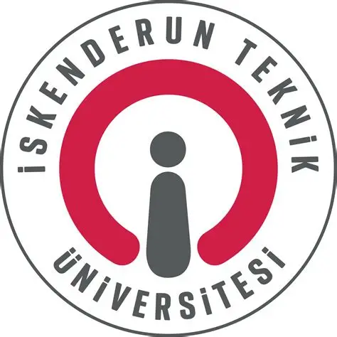
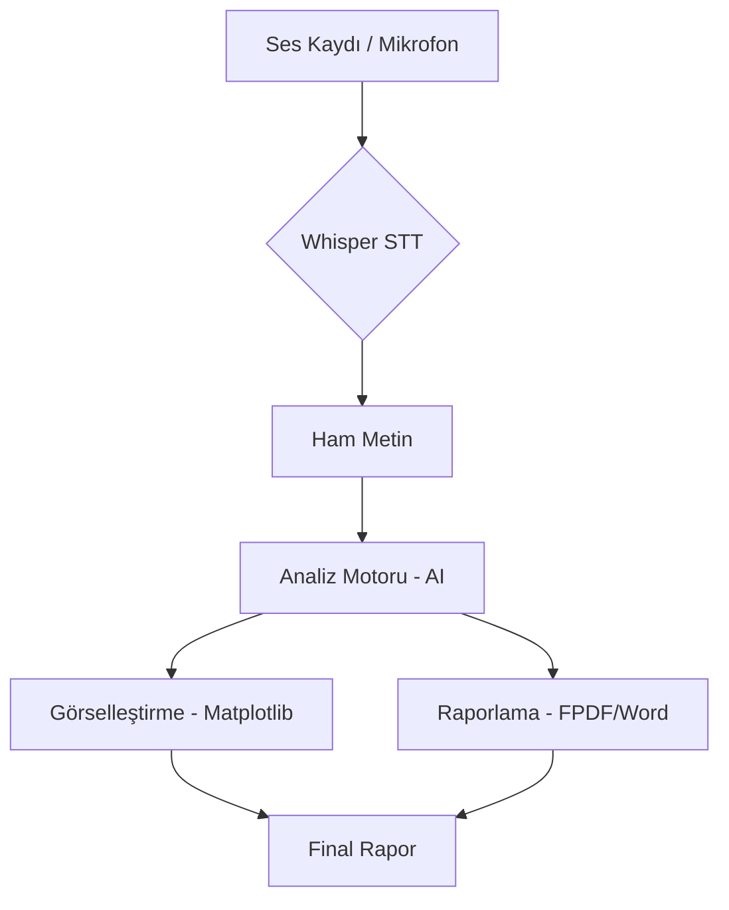

# 🎙️ Akıllı Ses Analiz ve Doğrulama Sistemi


Bu proje, modern ses işleme teknolojileri ile en gelişmiş yapay zeka modellerini harmanlayan profesyonel bir masaüstü uygulamasıdır. Kullanıcıların sesli verilerini %99'a varan doğrulukla metne dönüştürür, bu verileri akademik ve kurumsal standartlarda analiz eder ve görsel grafiklerle desteklenmiş profesyonel raporlar üretir.

---

## 📸 Uygulama Arayüzü
<div align="center">
  
  <p><i>Modern Cyberpunk Glassmorphism Tasarımı</i></p>
</div>

---

## ✨ Temel Özellikler

### 🛡️ Ses ve Transkripsiyon
- **Hibrit Whisper Entegrasyonu:** `OpenAI Whisper` modelleri ile cihazınızın donanımına (GPU/CPU) özel optimize edilmiş transkripsiyon.
- **Auto-VAD:** Voice Activity Detection teknolojisi ile sessiz sahneleri algılama ve otomatik kayıt sonlandırma.
- **Dinamik Görselleştirici:** Ses dalgalarını gerçek zamanlı olarak izleyen modern spektrum çubuğu.

### 🧠 Akıllı Analiz Motoru
- **GPT-4o & Gemini Duo:** Dünyanın en güçlü iki dil modelini kullanarak derinlemesine içerik analizi.
- **Persona Sistemi:** Profesyonel Analist, Sert Mentor veya Teknoloji Gurusu gibi farklı kimliklerle etkileşim kurun.
- **Dil Koçu Modülü:** Yabancı dilde konuşma pratiği yapın, hatalarınızı AI yardımıyla düzeltin.

### 📊 Görselleştirme ve Raporlama
- **Gelişmiş Grafikler:** WordCloud (Kelime Bulutu) ve %100 normalize edilmiş Duygu Durum (Sentiment) pasta grafikleri.
- **Kurumsal PDF Çıktısı:** Tüm analizleri, transkriptleri ve grafikleri içeren şık PDF raporları.
- **Word Desteği:** Raporlarınızı düzenlenebilir `.docx` formatında dışa aktarma imkanı.

---

## 🛠️ Kurulum Rehberi

### 1. Mikro-Kurulum (Otomatik)
Ses motoru için gerekli olan FFmpeg aracını tek komutla kurabilirsiniz:
```bash
python setup_ffmpeg.py
```

### 2. Bağımlılıkları Yükleme
Uygulamanın çalışması için gerekli kütüphaneleri yükleyin:
```bash
pip install -r requirements.txt
```

> [!IMPORTANT]
> **NVIDIA GPU Kullanıcıları İçin:** Transkripsiyon hızını 10 kat artırmak için PyTorch'un CUDA sürümünü kurun:
> `pip install torch torchvision torchaudio --index-url https://download.pytorch.org/whl/cu118`

---

## ⚙️ Yapılandırma ve Başlangıç

1. **API Anahtarları:** Ayarlar (`Settings`) sekmesinden OpenAI ve Gemini API anahtarlarınızı girin. Bilgileriniz güvenli bir şekilde `.env` dosyasında saklanır.
2. **Çalıştırma:** Ana uygulamayı başlatmak için:
   ```bash
   python main.py
   ```

---

## 🧬 Proje Mimarisi



---

## 🎓 Akademik Künye

Bu proje, **İskenderun Teknik Üniversitesi (İSTE)** bünyesinde, Mühendislik Fakültesi dersleri kapsamında geliştirilmiştir.

- **Hazırlayan:** Mehmet Karataş
- **Öğrenci No:** 222523002
---

## 📜 Lisans
Bu proje **MIT Lisansı** altında lisanslanmıştır. Daha fazla bilgi için [LICENSE](LICENSE) dosyasına bakabilirsiniz.
